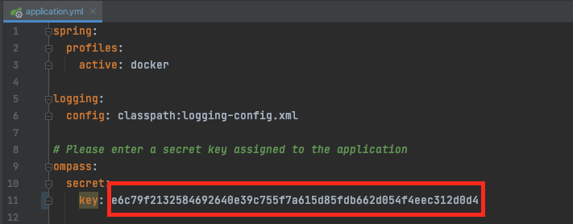
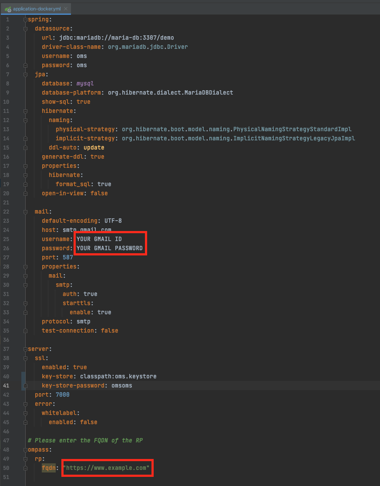
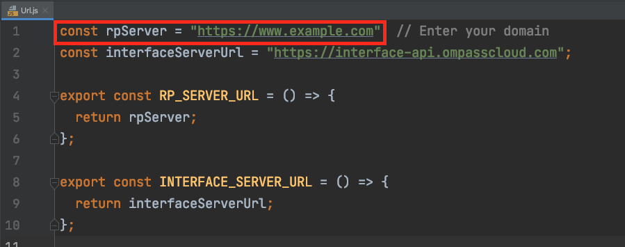
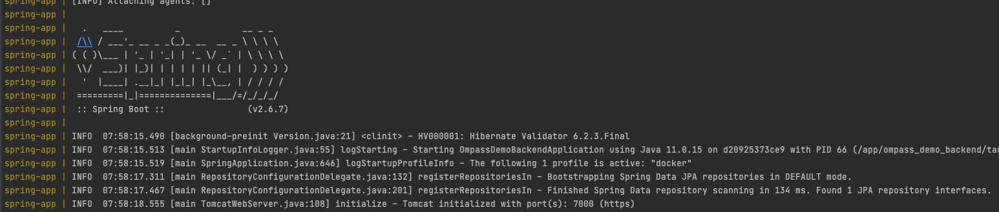
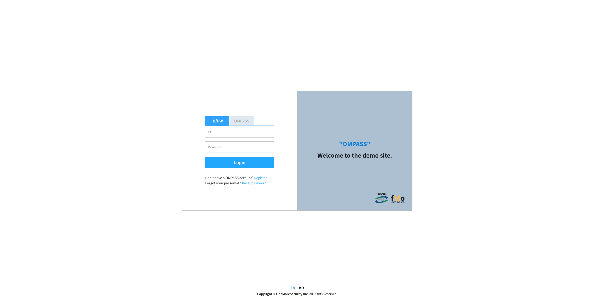

# OMPASS_DEMO

## 1. Registration ([For instructions]("https://www.ompasscloud.com/en/document/join"))
- Before testing out OMPASS_DEMO, you must proceed with registration.

## 2. Generating a Secret Key for OMPASS API Call ([For instructions]("https://www.ompasscloud.com/en/document/application"))
- After logging in to your account, select "Applications" tab from App Management on the left.
- Click the [Register] button.
- Enter an application name. (e.g. DEMO) and click the [Check Availability] button
- Enter a domain to be used in OMPASS_DEMO. (ex. https://www.example.com)
- Enter a redirect URL containing "/ompass" at the end (ex. https://www.example.com/ompass)
- Leave the policy as "Default Policy", then click [Register].
- Select the application you created, then click the [Edit] button.
- Check the generated "secret key", then copy it to use in "Backend Settings" afterwards.

## 3. Change Settings in Code
### Backend Settings
1. After entering the git clone command, modify the "application.yml" with the previously genreated "secret key" on step 2.
   
> ompass_demo/ompass_demo_backend/src/main/resources/application.yml
    

2. Open the "application-docker.yml" file and edit its settings.
    1. Change its ID and password to yours used in gmail. (first box below)
    2. Change the domain you entered when creating the application on the admin page. (second box below)

> ompass_demo/ompass_demo_backend/src/main/resources/application-docker.yml
> 

### Frontend Settings
1. Open the file below "Url.js" and edit to the domain you entered when creating the application on the admin page.

> ompass_demo/ompass_demo_frontend/src/rest/Url.js

 
 

## 4. Run Docker Compose

1. Install docker.

2. Go to the top-level directory of the OMPASS project.

> ompass_demo

3. Run docker compose (Run docker compose by one of the following)

> Docker run command in foreground : docker-compose up

> Docker run command in background : docker-compose up -d 

4. Server Startup Complete (Server startup is completed if the image below shows up)

## Access to OMPASS_DEMO Login Page

1. Enter the domain previously registered in the application into the browser to access the login page.

